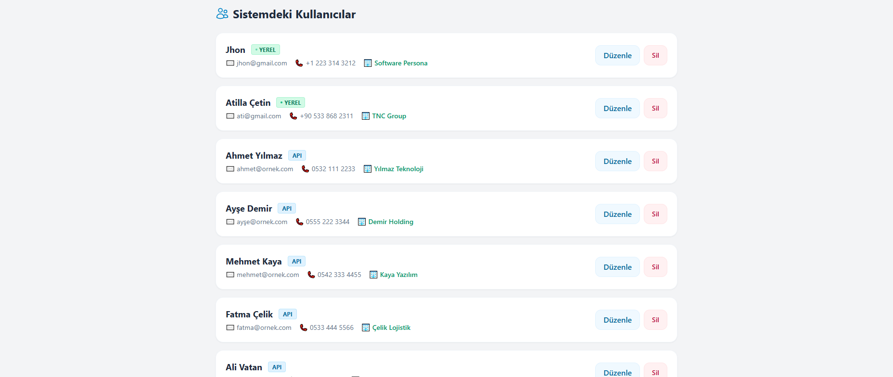
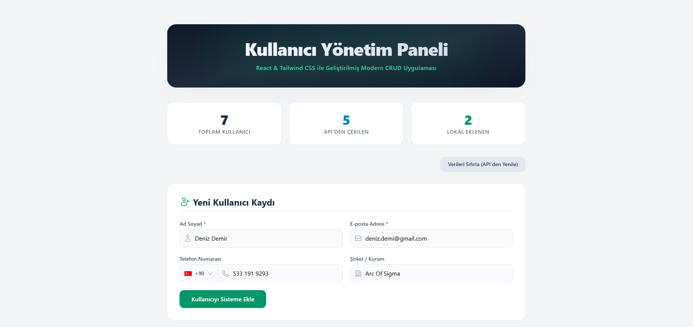
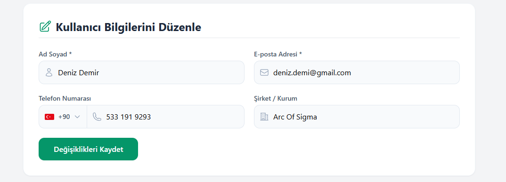

# 🚀 Kullanıcı Yönetim Paneli (React CRUD)

Modern Web Dünyasına Giriş eğitimi bitirme projesi kapsamında geliştirilmiş; uzak API entegrasyonu ve LocalStorage (yerel depolama) özelliklerine sahip profesyonel bir CRUD uygulamasıdır.

## 📸 Proje Ekran Görüntüsü





## ✨ Proje Özellikleri

* ✅ **API Entegrasyonu:** [JSONPlaceholder](https://jsonplaceholder.typicode.com/users) üzerinden çekilen veriler dinamik olarak Türkçe'ye çevrilerek listelenir.
* ✅ **Gelişmiş Form Yönetimi:** Dinamik ülke bayraklı telefon formatlama ve input bazlı görsel doğrulama mevcuttur.
* ✅ **Veri Kaynağı Ayrımı:** Listede API'den gelen veriler ile kullanıcı tarafından yerel eklenen veriler (**YEREL/API**) ayırt edilebilir.
* ✅ **Tam CRUD Desteği:** Kullanıcı Ekleme, Listeleme, Güncelleme ve Silme işlemleri eksiksiz çalışmaktadır.

## 📁 Proje Klasör Yapısı
```text
src/
├── Components/    # UserForm ve UserList bileşenleri
├── Pages/         # Home (Ana Sayfa) tasarımı
├── Interfaces/    # User (TypeScript Tip Tanımları)
└── assets/        # Proje görselleri (Ekran görüntüleri vb.)

🛠️ Kullanılan Teknolojiler
ReactJS - UI Kütüphanesi

TypeScript - Tip Güvenliği

Tailwind CSS - Modern Tasarım

Vite - Build Aracı

Netlify - Hosting

🌍 Canlı Yayın (Netlify)
🔗 atilla-cetin-crud.netlify.app

👨‍💻 Geliştirici
Ad Soyad: Atilla Çetin

Proje: Web Geliştirme; Javascript Proje Bilgisi